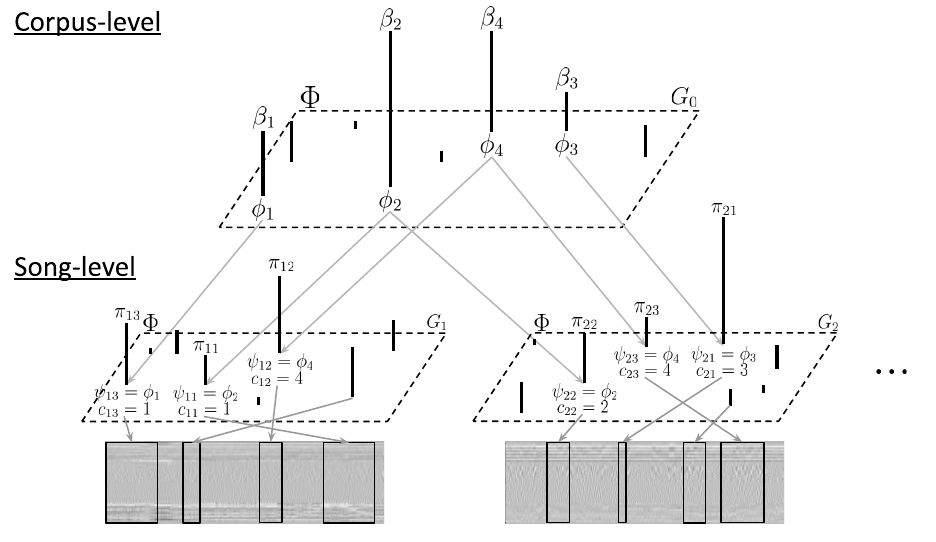

HDPGMM Music Experiments
========================

***IMPORTANT This repository is still under construction! will be officially "usable" soon. Until then, you can freely check out the codebase. IMPORTANT***




This repository is a companion material associated with the paper, ["the power of deep without going deep? a study of HDPGMM music representation learning"](https://archives.ismir.net/ismir2022/paper/000013.pdf). In particular, it contains the experimental routine that is used for generating the data and analysis assistant scripts (in R, see `analysis` directory). The main algorithm implementation can be found in [the separate repository](https://github.com/eldrin/pytorch-hdpgmm/tree/ismir22).

Below we describe steps that allows re-produce the experimental routine, except a few steps (i.e., [fetching audio samples of Million Song Dataset](http://millionsongdataset.com/))


## Installation

Here we discuss the procedure for setting up python (virtual) environment. Specifically, we use `conda` and `environment.yaml`. If `conda` command is available already, the python virtual environment can be setup by following command.

```{bash}
conda env create -f environment.yaml
```

If `conda` or `miniconda` is not available yet, the entire setup process (including setting up the virtual environment) can be done locally by following command.

```{bash}
sh install_env.sh
```

This installation will install separate `miniconda` instance inside this project directory, thus does not technically interfere each other if there is a system-wide `miniconda` preinstalled. But activating the specific conda environment embedded in this project requires custome command.

```{bash}
export project_path=/path/to/project/hdpgmm-music-experiments/
source ${project_path}/miniconda3/bin/activate hdpgmm_music_experiment
```

(this command is executed at the end of the installation script)

### Note on macOS

It seems there is a bug in python on macOS when importing the `soundfile` package. It seems to look up `libsndfile.dylib` on the wrong places (at least on the tested machine of mine). It can be temporarily resolve by export right location of the `libsndfile.dylib`:

```{bash}
brew install libsndfile
export DYLD_LIBRARY_PATH="/opt/homebrew/lib:$DYLD_LIBRARY_PATH"; python scripts/some_script.py
```

It may not be case that the location is under `/opt/homebrew/lib`. The location can be easily identified and assigned by following command:

```{bash}
libsndfile_loc=$(brew list libsndfile | grep libsndfile.dylib | xargs dirname)
export DYLD_LIBRARY_PATH="${libsndfile_loc}:$DYLD_LIBRARY_PATH"
python scripts/some_script_loads_soundfile.py
```

There probably are other hacks such as installing the library through `conda`, (i.e., [libsndfile](https://anaconda.org/conda-forge/libsndfile)), but haven't tested yet.


## Obtain data 

### Preprocessed datasets, pre-trained models, extracted representations

We provide the relevant data files [here](https://data.4tu.nl/articles/dataset/Supplementary_material_of_the_paper_The_power_of_deep_without_going_deep_A_study_of_HDPGMM_music_representation_learning_/21981442).  With total size of ~140GB, the package includes: 1) datasets preprocessed with selected audio features, 2) pre-trained models (VQCodebook, HDPGMM, KIM, CLMR), and finally 3) representations extracted from these models.

For the detailed description of the data files, please check the data repository linked above.


### Downstream datasets

Download procedure of downstream datasets are relatively easy, as they are either well maintained by their original repository (i.e., [MTAT](https://mirg.city.ac.uk/codeapps/the-magnatagatune-dataset), [Echonest-MSD](http://millionsongdataset.com/tasteprofile/)) or alternative sources to downloads. (i.e., [GTZAN](https://www.kaggle.com/datasets/andradaolteanu/gtzan-dataset-music-genre-classification))

Once they're downloaded, follow the below preprocessing steps to conduct the study.


## Dataset pre-processing

This subsection discusses the pre-processing routine of datasets.


### Million Song Dataset (the training corpus)

```
TBD
```

### Preprocessing downstream datasets

#### GTZAN

```{bash}
python -m src.scripts.preprocessing gtzan \
    -p /output/path/ \
    --verbose \
    /root/path/where/gtzan/is/extracted/
```

`gtzan_path` needs to be set as the top level directory contains the audio files. (i.e., `genres`directory) If there is no specific parameters set, it extracts the "feature" with default setup where `n_fft=2048`, `hop_s=512`, and `mel_len=128`.


#### MagnaTagATune

```{bash}
python -m src.scripts.preprocessing mtat \
    -p /output/path/ \
    --verbose \
    /root/path/where/mtat/is/extracted/
```

similarly to the `gtzan` script, it assumes a particular file-tree as follows:

```
-- mtat_path/
|-- audio/
| |-- 0/
| |-- 1/
| |.../
| |-- f/
|-- annotations_final.csv
```

(If the data is downloaded by the way above, it automatically organized in such a way.) By default it extracts `features` with same setup as mentioned above.


#### Echonest

```{bash}
python -m src.scripts.preprocessing echonest \
    -p /output/path/ \
    --verbose \
    /MSD/mp3/root/path/ \
    /MSD/path/info.pkl \
    /MSD/song/2/track/map.pkl \
    /where/echonest/stored/train.txt
```

In addition to regular arguements, it requires additional environment variable specifying the path of the audio file from MSD dataset. This downstream dataset uses a subset of MSD dataset, thus it can make the process more efficient. On top of that, user needs to provide a couple of pre-processed metadata files (i.e., `msd_path_info`, `msd_song2track`) which specifically bound to the dataset collection of our own. Thus this command might not work with other data collection scheme, similarly to the MSD training pre-processing step. Finally, providing `echonest_triplet` and `out_path` will suffice the script to run the preprocess. It by default extracts audio features and hyper-parameters are same as above.


### Train representation models

Training the representation differs per model. For instance, the routine for fitting `vqcodebook` models can be invoked by following command.

```{bash}
python -m src.scripts.fit_vqcodebook \
    -k 256 \
    --verbose \
    /dataset/path/dataset.h5 \
    /out/path/ \
    "out_fn_prefix"
```

On the other hand, `hdpgmm` models can be trained by following command.

```{bash}
python -m src.scripts.fit_hdpgmm \
    --device "cpu" \
    --no-augmentation \
    --verbose \
    /path/to/config.json
```

For the two deep learning based representations, we mostly depend on the helper scripts/CLI interface which is provided from their original repositories. For instance, `Kim et al. (2020)` model can be trained by following command.

```{bash}
mtltrain /path/to/config.json
```

the example configuration file can be found at [here](https://github.com/eldrin/MTLMusicRepresentation-PyTorch/blob/master/configs/test_hdf.json). This routine also requires specific data pre-processing, which can be done by [this script](https://github.com/eldrin/MTLMusicRepresentation-PyTorch/blob/master/scripts/build_hdf_dataset.py).

Finally, the model by `Spijkervet and Burgoyne (2021)` can be trained by running following script after cloning [our own clone](https://github.com/eldrin/CLMR/tree/hdpgmm_study_mod) (and mod) of the original [`CLMR`](https://github.com/Spijkervet/CLMR).

```{bash}
clone https://github.com/eldrin/CLMR.git
cd CLMR
git checkout hdpgmm_study_mod
python main.py --dataset audio --dataset_dir ./directory_containing_audio_files
```


### Extract representation

For the "extraction" of the representation, we provide a CLI interface.

```{bash}
python -m src.scripts.feature_extraction
usage: extractfeat [-h] [--model-path MODEL_PATH] [--split-path SPLIT_PATH] [--device DEVICE]
                   [-m BATCH_SIZE] [-j N_JOBS] [--verbose | --no-verbose]
                   {vqcodebook,hdpgmm,G1,precomputed} dataset_path {mtat,gtzan,echonest} out_path
extractfeat: error: the following arguments are required: model_class, dataset_path, dataset, out_path
```

The deep learning based representation we introduced above, again, cannot be directly called by the script to extract representation. For instance, representation from `Kim` model can be extracted by calling a extraction help tool installed from the [dependency](https://github.com/eldrin/MTLMusicRepresentation-PyTorch) of this repository.


```{bash}
mtlextract --device "cpu" model_checkpoints.txt target_audios.txt /out/root/
```

The 'model checkpoints' text file lists the model checkpoint files trained from `mtltrain` command, and 'target_audios.txt' contains the filename of each audio excerpt to be processed per line.


Finally, the `CLMR` representation can be extracted by following script:

```{bash}
# we assume you are at root directory of cloned `CLMR` as above.
python dev/feature_extraction_dev.py /path/to/config.yaml /path/to/checkpoint.ckpt
```
We provide the example config files per downstream dataset we experimented under the `configs/clmr_feature_ext_configs/`. After converting the audio files into wave format and placing in a directory (which can have the sub-directories for better organization), calling the script with cofiguration file will extract the representation from the pre-trained checkpoint file.


### Test with downstream tasks

Once the representation is extracted with respect to the downstream task, it is possible to proceed to cunduct the task specific machine learning test. It can be done by colling another helper module within the package.


```{bash}
python -m src.scripts.test_downstream
usage: test_downstream [-h] {echonest,gtzan,mtat} ...
test_downstream: error: the following arguments are required: command
```

By selecting specific downstream task

```{bash}
python -m src.scripts.test_downstream gtzan \
    -p /test/output/path/ \
    --random-seed 2022 \
    --verbose \
    /path/to/precomputed_features_per_task.npz \
    'precomputed' \
    /path/to/dataset.h5 \
    /path/to/split_file.txt
```

It supports extracting features directly from a subset of representation learners such as `hdpgmm` or `vqcodebook` if pre-trained model file is available. However, it is only provided for convenience and completeness, but not the most computationally efficient way.

Thus we recommend to almost always go with `precomputed` option with representation precomputed by the above block. It would be general way to also host any representation computed from any other models, for instance, the deep representation learner we test in this repo (eg. KIM and CLMR)


## Contributors

Jaehun Kim (jaehun.j.kim@gmail.com)


## How to contribute

Please leave issues (and perhaps send pull requests)! We don't have yet any format for issues (perhaps TBD), so feel free to take any form for now. Currently I am occupied by several projects and some other personal circumstances so might not guarantee to jump right on the issues, I will try to address them as much as possible.


## TODO

```
TBD
```


## Cite this work

```{bibtex}
@inproceedings{jaehun_kim_2022_7316610,
  author       = {Jaehun Kim and
                  Cynthia C. S. Liem},
  title        = {{The power of deep without going deep? A study of 
                   HDPGMM music representation learning}},
  booktitle    = {{Proceedings of the 23rd International Society for 
                   Music Information Retrieval Conference}},
  year         = 2022,
  pages        = {116-124},
  publisher    = {ISMIR},
  address      = {Bengaluru, India},
  month        = dec,
  venue        = {Bengaluru, India},
  doi          = {10.5281/zenodo.7316610},
  url          = {https://doi.org/10.5281/zenodo.7316610}
}
```


## Acknowledgement

```
A part of this work was carried out on the Dutch national e-infrastructure with the support of the SURF Cooperative.
```
